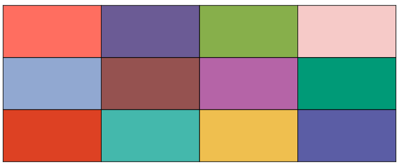

# CSS Assignment : Color Palette

In this assignment, you are required to create a table structure using HTML and apply different color codes to each box using CSS.

Each box must use a different color format — **HEX**, **RGB**, or **HSL** — as specified in the instructions below.

---

### Color Format:

- Box 1 — Use **HEX**  
- Box 2 — Use **RGB**  
- Box 3 — Use **HSL**  
- Box 4 — Use **HEX**  
- Box 5 — Use **RGB**  
- Box 6 — Use **HSL**  
- Box 7 — Use **HEX**  
- Box 8 — Use **RGB**  
- Box 9 — Use **HSL**  
- Box 10 — Use **HEX**  
- Box 11 — Use **RGB**  
- Box 12 — Use **HSL**
