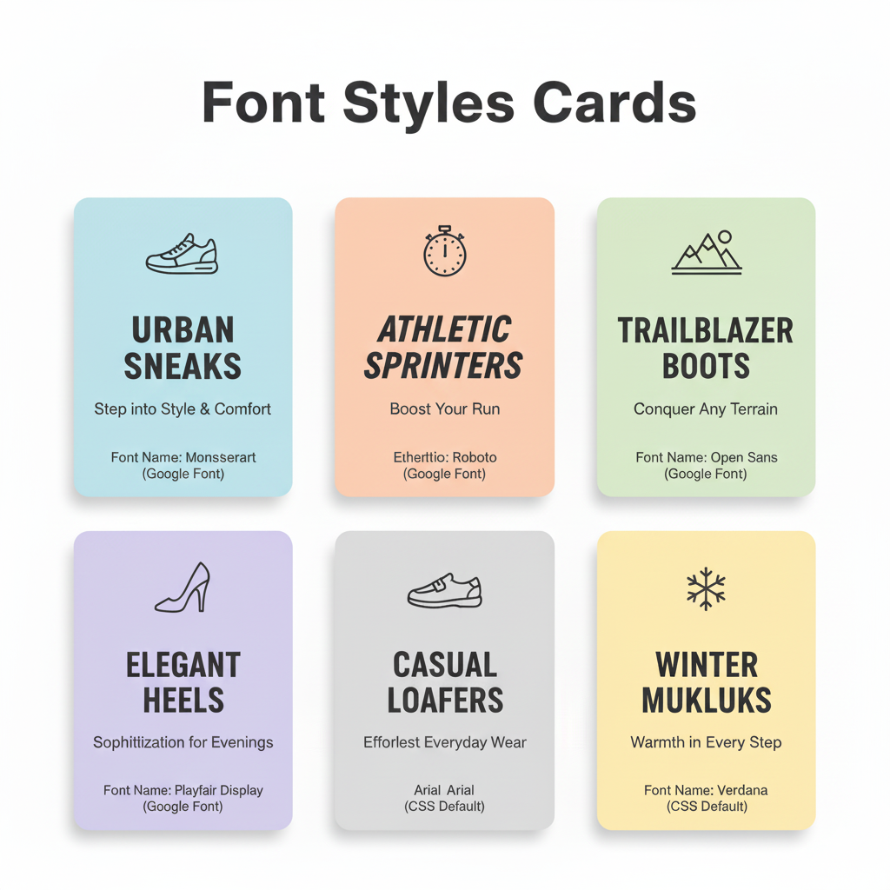

# CSS Assignment : Font Style Practice Custom & Default

### Description:
In this assignment, you are required to create **6 cards**. Out of these, **4 cards should use custom fonts** while the remaining **2 cards should use default CSS fonts**.

#### For the custom font cards:
- **2 cards** should use fonts that are downloaded and applied locally.
- **2 cards** should use fonts applied via direct links from Google Fonts.

  

You may arrange the cards using a **table layout** or a **div layout**, depending on your preference. The main focus is to practice using **custom and default fonts** while creating **visually appealing cards**.
