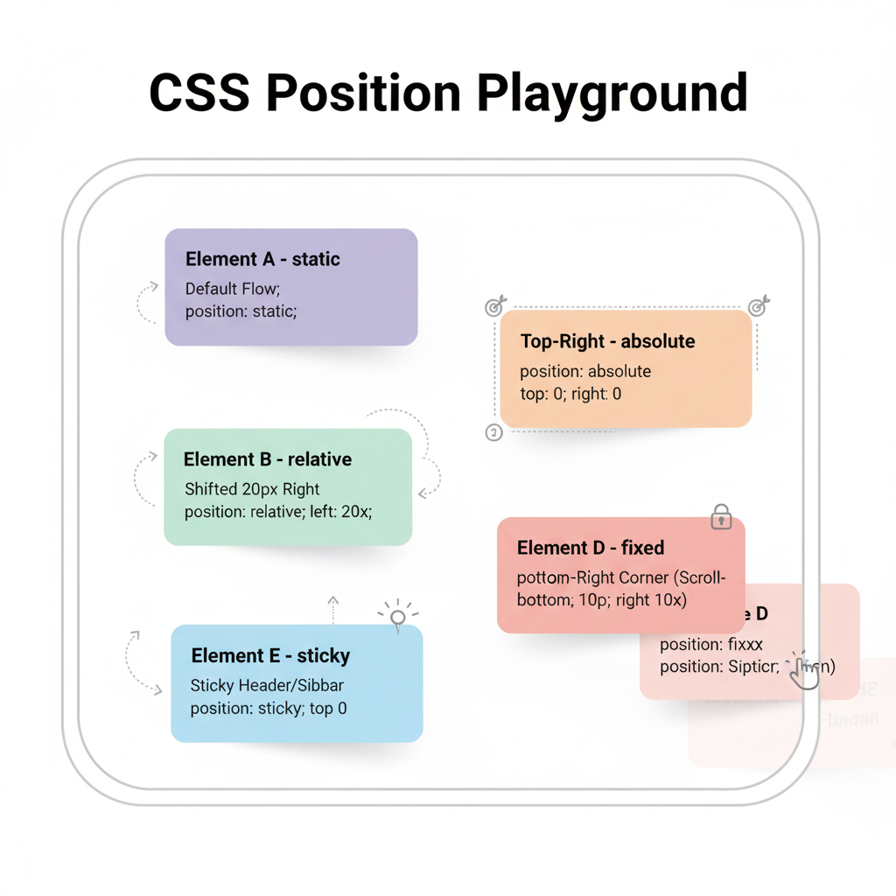

# CSS Position Assignments – Practical Projects

This set of practical projects will help you understand and master CSS positioning (`static`, `relative`, `absolute`, `fixed`, and `sticky`) through hands-on website examples.  
Each task includes a short description, a clear goal, and a space for an example image.

---

### 1. Five Boxes Playground

**Task:**  
Create 5 elements (represented as colorful "cards" or "notes" for a friendly look) inside a main container (except for the 'fixed' element, which will be directly in the body for its screen relative behavior). Each element will demonstrate a different CSS position type:

- **Element A** – static (Default position in flow)  
- **Element B** – relative (Shifted slightly from its normal position)  
- **Element C** – absolute (Positioned relative to its closest positioned ancestor)  
- **Element D** – fixed (Positioned relative to the viewport/screen, stays visible on scroll)  
- **Element E** – sticky (Behaves like relative until a scroll threshold, then becomes fixed)

**Goal:**  
To clearly understand and visually differentiate between static, relative, absolute, fixed, and sticky CSS position values, and how each affects an element's placement relative to the document flow, its parent, or the viewport.

**Example:**  

---
<!-- 
### 2. Badge on Profile Picture
**Task:**  
Make a profile card (photo, name, bio) and add an **“Online”** badge on the top-right of the image using absolute positioning.

**Goal:** Understand the relationship between relative and absolute positioning.

**Example:**  
*(Add image here)*

---

### 3. Fixed Sidebar Navigation
**Task:**  
Create a left-side sidebar that remains fixed while the right side has scrollable content.

**Goal:** Use `position: fixed` to keep navigation visible.

**Example:**  
*(Add image here)*

---

### 4. Sticky Header
**Task:**  
Create a top bar with a logo and links that stays at the top when scrolling.

**Goal:** Practice `position: sticky` behavior.

**Example:**  
*(Add image here)*

---

### 5. Floating Chat Button
**Task:**  
Create a circular chat button fixed at the bottom-right of the screen.

**Goal:** Use fixed positioning properly.

**Example:**  
*(Add image here)*

---

### 6. Hover Tooltip Button
**Task:**  
Create a button that shows a small tooltip above it when hovered.

**Goal:** Use `relative` + `absolute` for tooltip positioning.

**Example:**  
*(Add image here)*

---

### 7. Card Image Overlay
**Task:**  
Create a product or gallery card where overlay text (e.g. “Sale”) appears on the image.

**Goal:** Layer elements using `absolute` and `z-index`.

**Example:**  
*(Add image here)*

---

### 8. Notification Bell with Counter
**Task:**  
Create a bell icon with a small red counter at the top-right corner.

**Goal:** Use `absolute` positioning for overlapping UI elements.

**Example:**  
*(Add image here)*

---

### 9. Hero Section with Text Overlay
**Task:**  
Create a hero banner with a background image, dark overlay, and centered text.

**Goal:** Practice absolute positioning with `z-index` layering.

**Example:**  
*(Add image here)*

---

### 10. Popup Modal / Message Box
**Task:**  
Create a button that opens a centered popup box with a dim background.

**Goal:** Use `fixed` and `absolute` for centered overlays.

**Example:**  
*(Add image here)*

---

### 11. Dropdown Menu
**Task:**  
Create a navbar where hovering over “Services” shows a dropdown list.

**Goal:** Use absolute positioning to place the dropdown below the parent item.

**Example:**  
*(Add image here)*

---

### 12. Pinned Social Media Bar
**Task:**  
Create a vertical bar on the left with fixed social media icons that remain visible while scrolling.

**Goal:** Use fixed positioning for floating social icons.

**Example:**  
*(Add image here)*

---

### 13. Image Tooltip Preview
**Task:**  
Show text or overlay when hovering over an image.

**Goal:** Use `absolute` positioning and CSS transitions.

**Example:**  
*(Add image here)*

---

### 14. Bottom Fixed Banner / Cookie Consent
**Task:**  
Create a bottom bar that stays fixed on the screen with the text “We use cookies – Accept”.

**Goal:** Practice `fixed` positioning with full-width layout.

**Example:**  
*(Add image here)*

---

### 15. Card Stack / Overlapping Boxes
**Task:**  
Create three overlapping cards using absolute positioning and `z-index` for depth.

**Goal:** Practice overlapping layer control.

**Example:**  
*(Add image here)* -->
