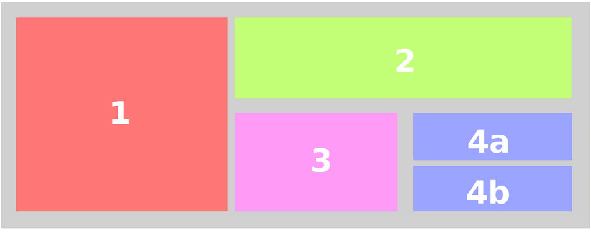
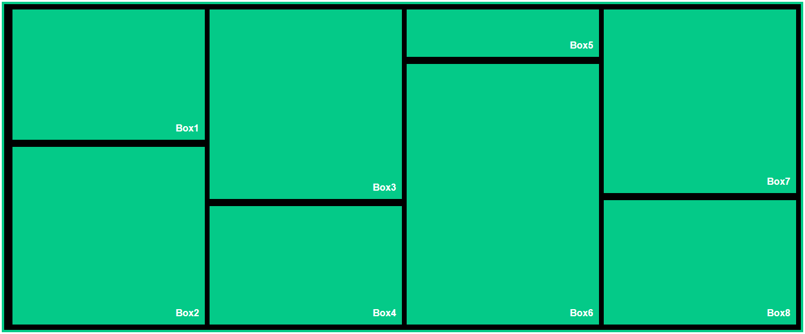

# Flexbox Practice Assignment

## Task 1: Recreate Layout 1
Use **CSS Flexbox** to recreate the layout shown below:

### Layout Preview  

---

## Task 2: Recreate Layout 2
Build the following 8-box layout using **Flexbox only**:

### Layout Preview  

---

## Extra Practice
Strengthen your Flexbox skills by completing this game:  
👉 https://flexboxfroggy.com

---

## Submission
- Submit two files: `layout1.html` and `layout1.css`, `layout2.html` and `layout2.css`
- The structure must match the designs (colors are your choice).
