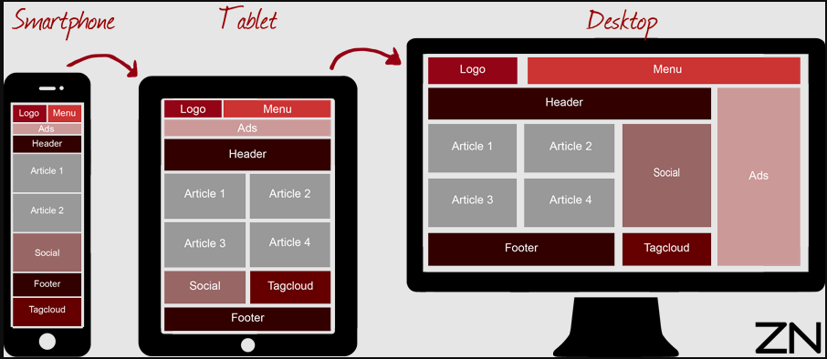

#  Responsive Flexbox Layouts – Practical Assignment

---

## Task 1: Multi-Device Adaptive Layout

Using **CSS Flexbox**, recreate the following **adaptive multi-section webpage layout**.  
Your design must respond smoothly across **desktop**, **tablet**, and **mobile** screen sizes.

### Layout Preview  

---

## Task 2: Responsive Dashboard Interface

Build the following **dashboard-style responsive interface** using only Flexbox.  
Ensure that the layout realigns properly on **mobile**, **tablet**, and **desktop** devices while maintaining a clean structure.

###  Layout Preview  

---

## ✅ Requirements

- Use **Flexbox only** (CSS Grid not allowed)  
- Include at least **three breakpoints**:
  - **Mobile View**
  - **Tablet View**
  - **Desktop View**
- Match the **structure** of the provided layouts  
- Colors and styling are **your choice**

---

## 🎯 Objective

This assignment will help you understand **responsive layout techniques**, improve your **Flexbox mastery**, and practice building real-world responsive UI structures.

