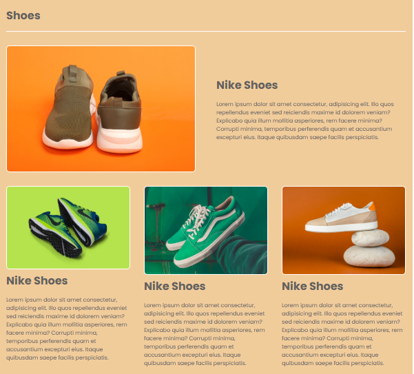
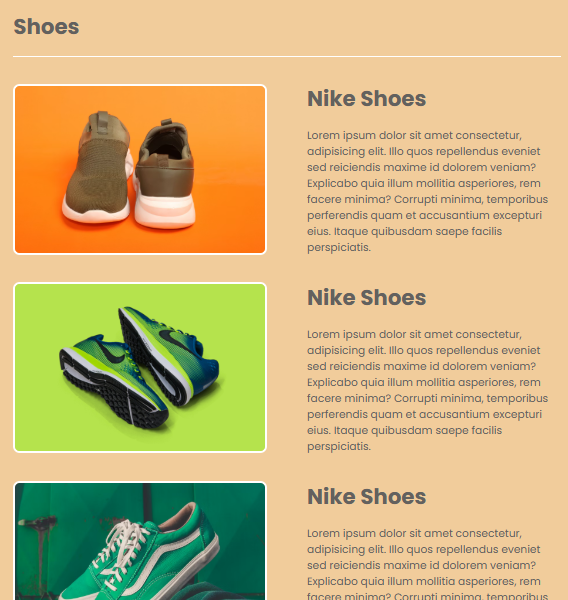
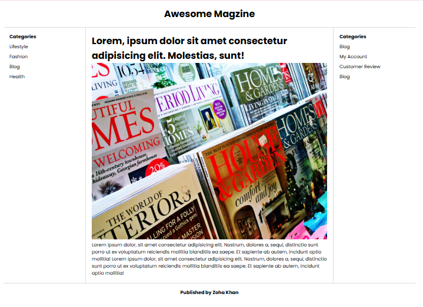
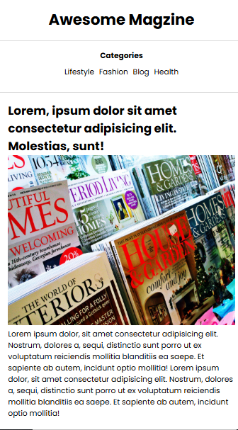
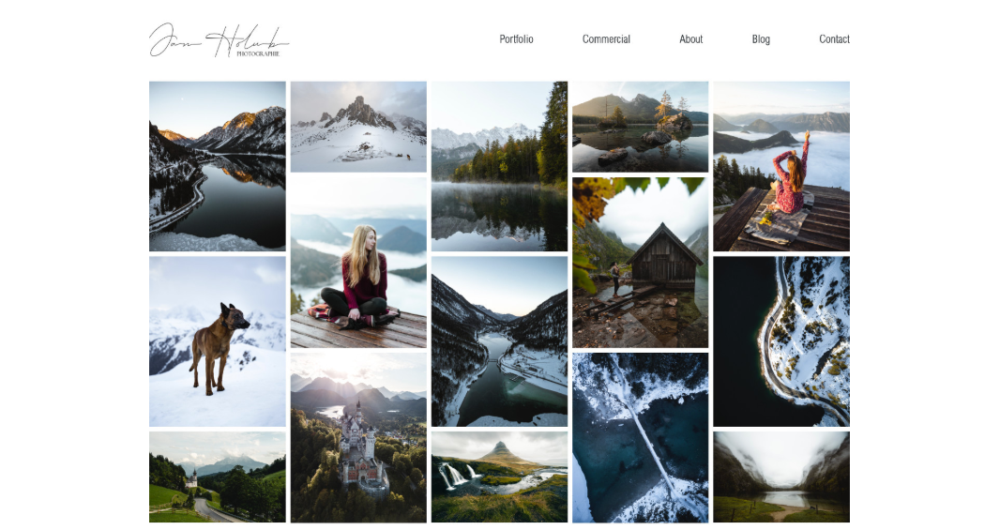

# CSS Grid Layout Homework

The goal of this assignment is to strengthen your understanding of **CSS Grid** and building **responsive layouts**.  
First, revise and practice the layouts created in class. After that, create a new layout independently.

---

## First Layout: Shoes Website (CSS Grid)

This layout was created in class using CSS Grid.  
The purpose of this layout is to understand grid-based structure and responsive behavior.

**Desktop View** 

**Mobile View** 

### Live URL

https://smit-grid-template-1.netlify.app

---

## Second Layout: Blog Website (CSS Grid)

This blog layout was built using CSS Grid to understand content alignment, layout structure, and responsiveness.

**Desktop View**

**Mobile View**

### Live URL

https://smit-blog-grid-2.netlify.app/

---

## Third Layout: Image Gallery Assignment

In this task, you will create an **Image Gallery** using **CSS Grid**.  
The gallery should be **responsive**, meaning it should adjust properly for both desktop and mobile screen sizes.

You are free to choose your own layout and images, but CSS Grid must be used.

### Screenshot (Desktop View)

---

## Submission Instructions

Complete the following tasks first:

- Practice and complete the **Shoes layout**
- Practice and complete the **Blog layout**
- Create the **Image Gallery** using CSS Grid

Once all layouts are ready, push your work to **GitHub** and deploy it on **Netlify**.

At the time of submission, provide the following links:

- GitHub repository containing your layouts: **GitHub URL**  
- Netlify live site with your deployed layouts: **Netlify URL**

