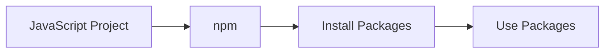

# 📘 Node.js, npm & Packages

In this lecture, we will learn how JavaScript projects use Node.js, npm, and external packages.

These ideas are important before learning JavaScript modules and Firebase.

## 📚 Topics Covered

1. **Node.js and Runtime Environment**
2. **Browser JavaScript vs Node.js**
3. **npm and Packages**
4. **Dependencies and `package.json`**
5. **`node_modules` and `package-lock.json`**
6. **Installing and Using Axios**
7. **Creating a Node.js Project**
8. **Using `.gitignore` with `node_modules`**

# 1. 🎯 Learning Objectives

By the end of this lecture, you should understand:

- What Node.js and a runtime environment are
- The difference between browser JavaScript and Node.js
- What npm, packages, dependencies, and `package.json` are
- What `node_modules` and `package-lock.json` are
- How to create a Node.js project
- How to install and use a package
- Why `node_modules` is not uploaded to GitHub

# 2. 🟢 What Is Node.js?

Node.js is a JavaScript runtime environment that allows us to run JavaScript outside the browser.

Node.js allows us to execute JavaScript code without a browser.

A runtime environment is the place and tools that execute our code. Browser JavaScript runs inside a browser. Node.js runs JavaScript on our computer.

```text
Browser
   ↓
JavaScript runs inside the browser


Node.js
   ↓
JavaScript runs outside the browser
```

Create a file named `app.js`:

```js
console.log("Hello from Node.js!");
```

Run it in the terminal:

```bash
node app.js
```

Node.js executes the file and prints the message in the terminal.

# 3. ⚖️ Browser JavaScript vs Node.js

| Browser JavaScript | Node.js |
| --- | --- |
| Runs inside a browser | Runs outside the browser |
| Used heavily for web UI | Can be used for development tools and backend work |
| Has access to browser APIs | Has access to Node.js APIs |
| Works with the DOM | Can work with files and system resources |

This lecture focuses only on the basic Node.js and npm ecosystem.

# 4. 💻 Install and Check Node.js

Node.js includes npm. After installing Node.js, check both versions:

```bash
node -v
npm -v
```

- `node -v` shows the installed Node.js version.
- `npm -v` shows the installed npm version.

# 5. 📦 What Is npm?

npm stands for **Node Package Manager**. It helps developers install and manage reusable packages in JavaScript projects.

npm can:

- Install packages
- Manage packages
- Track project dependencies
- Install all dependencies of a project



# 6. 🛠️ Create a Node.js Project

Create a folder named:

```text
node-npm-class
```

Open the terminal inside this folder and run:

```bash
npm init -y
```

This creates a `package.json` file with basic project information.

Initial structure:

```text
node-npm-class/
│
├── app.js
└── package.json
```

# 7. 📄 What Is `package.json`?

`package.json` is an important file that stores information about a JavaScript or Node.js project and its dependencies.

Example:

```json
{
  "name": "node-npm-class",
  "version": "1.0.0",
  "description": "",
  "main": "app.js",
  "scripts": {},
  "keywords": [],
  "author": "",
  "license": "ISC"
}
```

The most useful fields for now are:

- `name`: the project name
- `version`: the project version
- `scripts`: commands that can be saved for the project
- `dependencies`: packages required by the project

The `dependencies` section appears after we install a package.

For example, after installing Axios, it may appear like this:

```json
"dependencies": {
  "axios": "^1.x.x"
}
```

Axios is added to `dependencies` after running `npm install axios`.

# 8. 🧩 What Is a Package?

A package is reusable code that developers can install and use in their projects.

Packages help us save time, reuse existing functionality, avoid writing everything from scratch, and add features to a project.

```text
Our Project
     ↓
npm
     ↓
External Package
     ↓
Reusable Functionality
```

# 9. 🔗 What Is a Dependency?

A dependency is a package that a project needs for certain functionality.

For example:

```json
"dependencies": {
  "axios": "^..."
}
```

After installation, Axios becomes a dependency of the project.

# 10. 🚀 Install Axios

Axios is a popular JavaScript library used to make HTTP requests.

Install it with:

```bash
npm install axios
```

The basic process is:

```text
npm install axios
       ↓
Axios is downloaded
       ↓
node_modules is created or updated
       ↓
package.json is updated
       ↓
package-lock.json is created or updated
```

# 11. 📁 What Is `node_modules`?

`node_modules` is the folder where npm stores installed packages and their dependencies.

```text
node-npm-class/
│
├── node_modules/
├── app.js
├── package.json
└── package-lock.json
```

- npm creates this folder.
- Installed packages are stored inside it.
- Developers normally do not edit it manually.

# 12. 🔒 What Is `package-lock.json`?

`package-lock.json` records the exact dependency tree and resolved package versions used by the project.

```text
package.json
      ↓
What the project needs

package-lock.json
      ↓
Exact dependency versions installed
```

# 13. ✅ Using the Installed Package

Update `app.js` with this example:

```js
const axios = require("axios");

axios
  .get("https://jsonplaceholder.typicode.com/users")
  .then((response) => {
    console.log(response.data);
  })
  .catch((error) => {
    console.log(error.message);
  });
```

Basic idea:

- Axios was installed through npm.
- `axios.get()` sends a GET request.
- The online service returns data.
- `response.data` contains the returned data.
- The result is printed in the terminal.

> We are using `require()` here only to demonstrate the installed package. The module system and modern `import`/`export` syntax will be taught properly in Lecture 02.

# 14. 🔄 `npm install` vs `npm install package-name`

| Command | Purpose |
| --- | --- |
| `npm install axios` | Install Axios and add it to the project dependencies |
| `npm install` | Install all dependencies listed in `package.json` |

# 15. ⚠️ Why `node_modules` Should Not Be Uploaded to GitHub

The `node_modules` folder can be very large, so it should normally not be committed to GitHub.

Create a file named `.gitignore` and add:

```text
node_modules/
```

`.gitignore` tells Git which files and folders should not be tracked or uploaded to GitHub.

If another developer downloads the project, they can run:

```bash
npm install
```

npm will read `package.json` and install the required dependencies.

# 16. 📂 Final Project Structure

```text
node-npm-class/
│
├── node_modules/
├── app.js
├── package.json
├── package-lock.json
└── .gitignore
```

| File / Folder | Purpose |
| --- | --- |
| `app.js` | JavaScript code |
| `package.json` | Project information and dependencies |
| `package-lock.json` | Exact dependency versions |
| `node_modules` | Installed packages |
| `.gitignore` | Tells Git what to ignore |

# 17. ⌨️ Important Commands

| Command | Purpose |
| --- | --- |
| `node -v` | Check Node.js version |
| `npm -v` | Check npm version |
| `npm init -y` | Create `package.json` |
| `npm install axios` | Install Axios |
| `npm install` | Install project dependencies |
| `node app.js` | Run a JavaScript file with Node.js |

# 18. ⚠️ Common Beginner Mistakes

## Mistake 1: Running npm commands outside the project folder

Open the terminal in the folder that contains `package.json`.

## Mistake 2: Forgetting to install dependencies

Run `npm install` before running a project downloaded from another computer.

## Mistake 3: Uploading `node_modules` to GitHub

Add `node_modules/` to `.gitignore`.

## Mistake 4: Manually changing dependency versions

Do not change versions unless you understand why the change is needed.

## Mistake 5: Thinking npm is a programming language

npm is a tool for managing JavaScript packages and project dependencies.

# 19. 📝 Practice Task

## Axios API Practice

1. Create a project folder.
2. Run `npm init -y`.
3. Install Axios:

   ```bash
   npm install axios
   ```

4. Create `app.js`.
5. Use Axios to request:

   ```text
   https://jsonplaceholder.typicode.com/users
   ```

6. Print the returned data in the terminal.
7. Create `.gitignore`.
8. Add:

   ```text
   node_modules/
   ```

# 20. 🧠 Quick Recap

1. What is Node.js?
2. What is npm?
3. What is a package?
4. What is `package.json`?
5. What is a dependency?
6. What is `node_modules`?
7. What is the difference between `npm install axios` and `npm install`?

# 21. 🔜 What We Will Learn Next

In the next lecture, we will learn JavaScript Modules:

- What are modules?
- `import`
- `export`
- Named exports
- Default exports
- Importing and renaming
- `import * as`
- ES Modules

**Next Lecture:** JavaScript Modules — `import` & `export`


# 22. 📚 Official Documentation

- [Node.js Official Website](https://nodejs.org/)
- [npm Official Website](https://www.npmjs.com/)
- [Axios Documentation](https://axios-http.com/)
